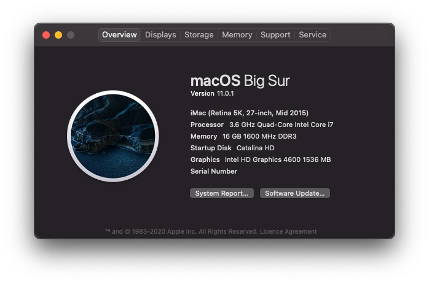

# OpenCore-Gigabyte-B85M-D2V
An OpenCore EFI configuration for the Gigabyte B85M-D2V Motherboard

OpenCore 0.6.3\
macOS Big Sur 11.0.1 (20B29)
## Hardware
Component | Brand
-|-

## Status

### What works

### What doesn't work

### Not tested / to do

## Used tools
Name | Description | URL
-|-|-
OpenCore | | https://github.com/acidanthera/OpenCorePkg
GenSMBIOS | To generate ROM and serials | https://github.com/corpnewt/GenSMBIOS
Xcode | To edit config.plist |
